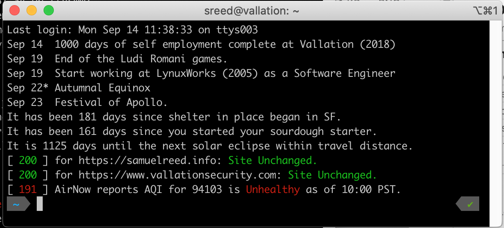

# srtermtools

This is a collection of terminal tools, usually triggered as part of a chain of .*rc files in order to display a few reminders and checks. 

Example of outputs:


* daycounter - gives a console output for the # of days since or before an upcoming event. Nice to keep track of accomplishments, upcoming events, or check how long since something has happened such as accidents on the factory floor.
* sitecheck - performs quick fuzzy hashes of websites and can check up on the hashes to identify various degrees of bit changes. Intended as a lightweight tripwire for changes or if the site is unavailable.
* aqicheck - checks air quality index for a zipcode, defaulting to the author's home. You will need an API key by signing up for one at https://docs.airnowapi.org/login and dropping it in a .dirty-aqi-api-key file.
* routerrebooter (DEPRECATED) - performs quick resets and port forwarding changes for the ancient Technicolor brand TC8305C router. It is pretty janky, and the whole request/resp flow was reverse engineered with a proxy since there is no API. 

How do I run the tests?
* python3 -m unittest discover -s tests -p '*_test.py'

To check test coverage:
* coverage erase; coverage run -m unittest discover -s tests -p '*_test.py'; coverage report

**DayCounter Tool**
```
Usage:
    daycounter.py countdown <eventdate> <event>...
    daycounter.py countup <eventdate> <event>...
```
daycounter.py is useful to keep track of major upcoming deadlines or how long something has been happening. The countdown always uses the phrase "It is X days until Y." and countup uses the phrase "It has been X days since Y."

**SiteCheck Tool**
```
Usage:
    sitecheck.py hash <url>
    sitecheck.py check <url> <lasthash>
```
This is cooked up as a quick sanity check to pull down a page and perform a fuzzy hash on the URL using ssdeep. ssdeep is a context triggered piecewise hash (CTPH), and has some interesting use cases for identifying things that are almost the same rather than identical. It can give you a rough gauge as to how much the input has varied from the original input, so it's useful just to use as both a health check and to determine if the pages I'm monitoring have been modified.

**AQICheck Tool**
```
Usage:
    aqicheck.py [<zipcode>] [--MOD|--USG|--UH|--VUH|--HAZ]
```
aqicheck.py will hit the AIRNow API and fetch a json blob containing both ozone and PM2.5 (think ground level), if you have registered for an API Key. These keys are free for anyone who wants to register, with the caveat that you do not hammer the API. In order to comply with this, aqicheck.py uses the requests_cache package to hold onto the last request that matches the provided parameters for one hour. By default, it will fetch AQI for the northen end of San Francisco's Mission district. If a zipcode is provided as a first optional parameter, it will fetch for that zipcode. The --MOD, --USG, --UH, --VUH, --HAZ all correspond to Moderate, Unsafe for Sensitive Groups, Unhealthy, Very Unhealthy, and Hazardous readings. If those flags are set, the command will not provide an output unless it is at least at those levels. This is intended for leaving a basic call inside a file like a .zshrc, such as "aqicheck.py 90210 --USG", which then will only alert the launcher of a terminal when their location in Beverley Hills has become bad enough for a mask amongst sensitive groups.

**RouterRebooter Tool - DEPRECATED**
```
Usage:
    routerrebooter check
    routerrebooter reset
    routerrebooter forward (enable|disable)
```
Honestly, unless you have this crummy type of Comcast router you're not going to need to use this tool. It does a quick reset or adjusts port fowarding as needed from the command line faster than the terrible asp website cooked into the router.

Update 2022: I have a new router from Comcast. As this code was written against an undocumented, blackbox firmware based web app, it naturally doesn't work anymore against new routers with updated firmware. Glad to see I don't need this, but it's an amusing relic from the past if I need a code snippet.